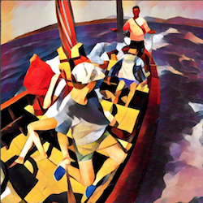
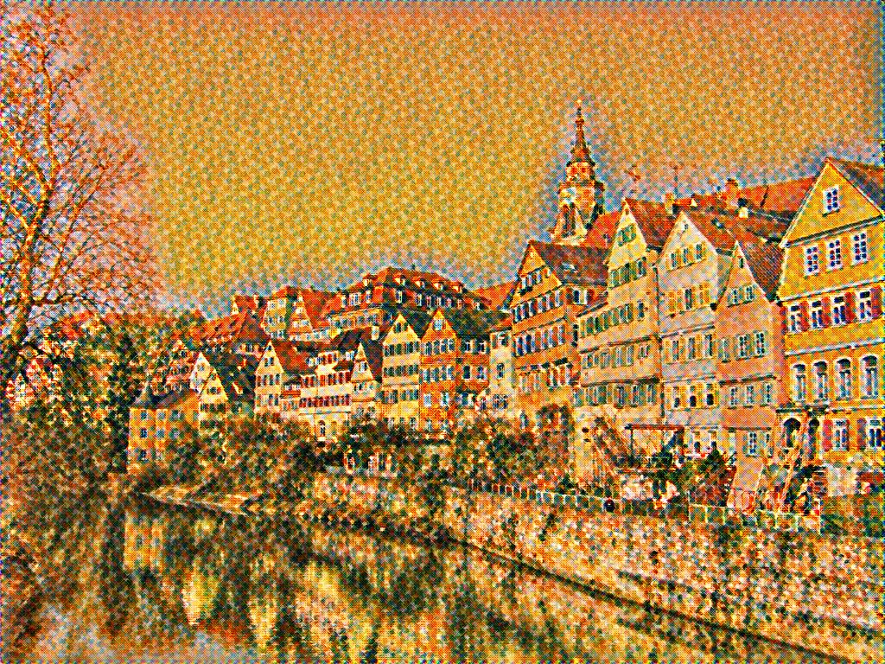
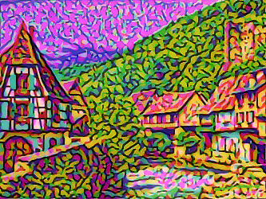
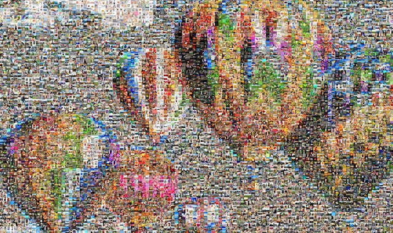
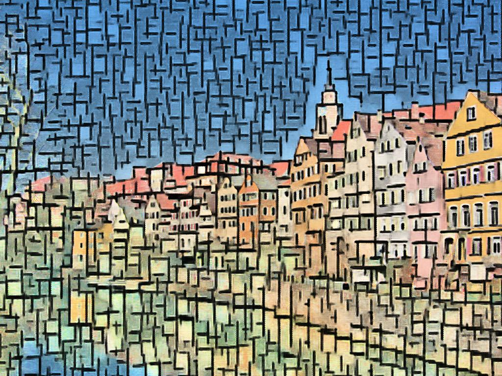
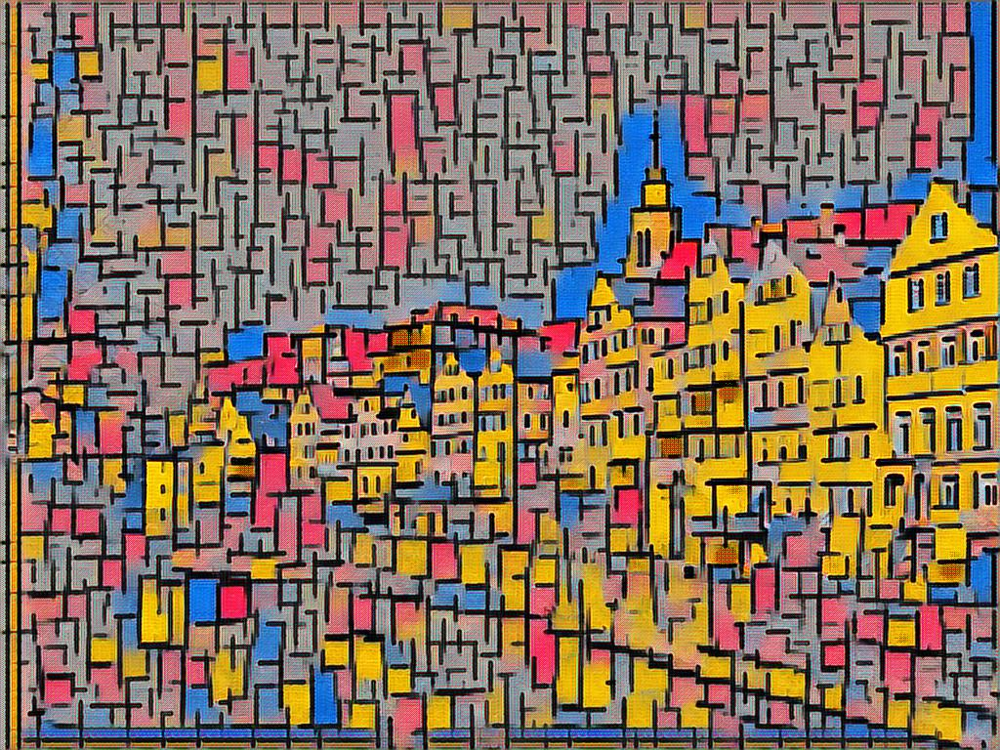
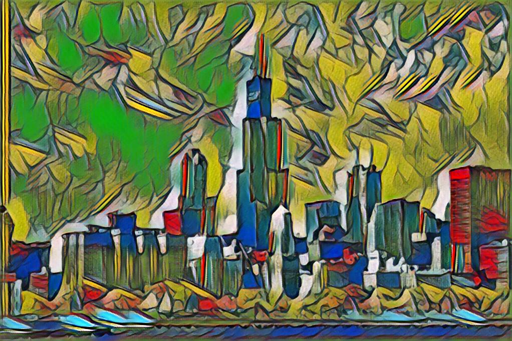
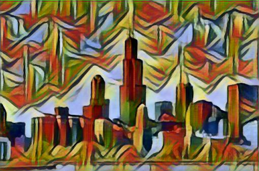

# Fast-Neural-Style
Fast neural style transfer images

Based on paper - [Perceptual Losses for Real-Time Style Transfer and Super-Resolution](https://arxiv.org/pdf/1603.08155.pdf)

Here are some example outputs from these models:

  
  
  
  
  
  
  
  

